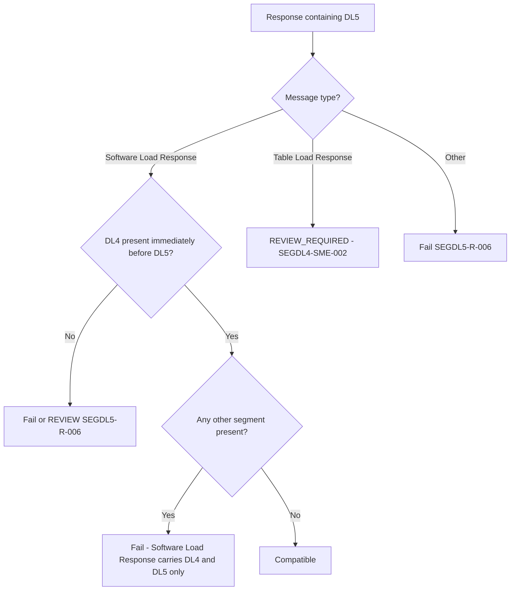

# Segment DL5 Companion-Segment Compatibility Decision Flow

```mermaid
flowchart TD
    A[Response containing DL5] --> B{Message type?}
    B -->|Software Load Response| C{DL4 present immediately before DL5?}
    C -->|No| X1[Fail or REVIEW SEGDL5-R-006]
    C -->|Yes| D{Any other segment present?}
    D -->|Yes| X2[Fail - Software Load Response carries DL4 and DL5 only]
    D -->|No| OK[Compatible]
    B -->|Table Load Response| R1[REVIEW_REQUIRED - SEGDL4-SME-002]
    B -->|Other| X3[Fail SEGDL5-R-006]
```

The earlier flow ("IP delivery XOR dial delivery") had no source and is withdrawn.
