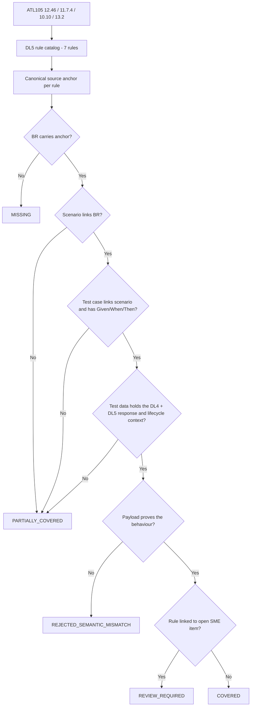

# Segment DL5 Coverage Closure Flow

```mermaid
flowchart TD
    A[ATL105 12.46 / 11.7.4 / 10.10 / 13.2] --> B[DL5 rule catalog - 7 rules]
    B --> C[Canonical source anchor per rule]
    C --> D{BR carries anchor?}
    D -->|No| M[MISSING]
    D -->|Yes| E{Scenario links BR?}
    E -->|No| P[PARTIALLY_COVERED]
    E -->|Yes| F{Test case links scenario and has Given/When/Then?}
    F -->|No| P
    F -->|Yes| G{Test data holds the DL4 + DL5 response and lifecycle context?}
    G -->|No| P
    G -->|Yes| H{Payload proves the behaviour?}
    H -->|No| S[REJECTED_SEMANTIC_MISMATCH]
    H -->|Yes| I{Rule linked to open SME item?}
    I -->|Yes| R[REVIEW_REQUIRED]
    I -->|No| J[COVERED]
```

Rules currently `REVIEW_REQUIRED` by design: `SEGDL5-R-002` (P-02), `R-005` (P-03), `R-006` (`SEGDL4-SME-002`).
