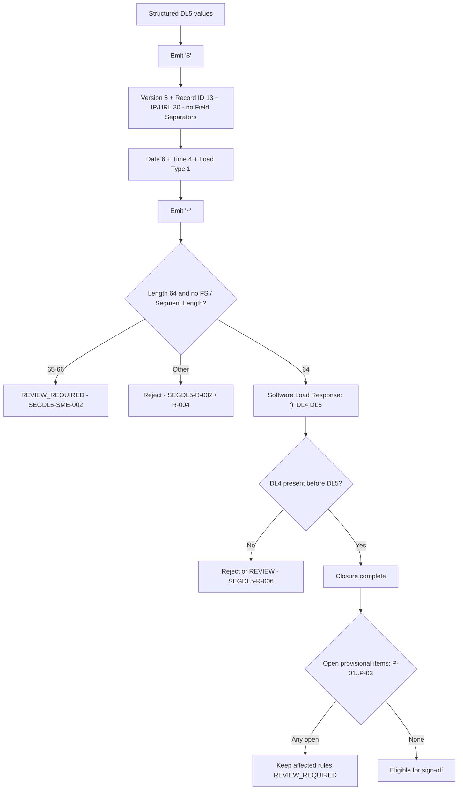

# Segment DL5 Final Closure Flow

```mermaid
flowchart TD
    A[Structured DL5 values] --> B["Emit '$'"]
    B --> C[Version 8 + Record ID 13 + IP/URL 30 - no Field Separators]
    C --> D[Date 6 + Time 4 + Load Type 1]
    D --> E["Emit '~'"]
    E --> F{Length 64 and no FS / Segment Length?}
    F -->|65-66| R1[REVIEW_REQUIRED - SEGDL5-SME-002]
    F -->|Other| X1[Reject - SEGDL5-R-002 / R-004]
    F -->|64| G["Software Load Response: ')' DL4 DL5"]
    G --> H{DL4 present before DL5?}
    H -->|No| X2[Reject or REVIEW - SEGDL5-R-006]
    H -->|Yes| Z[Closure complete]
    Z --> P{Open provisional items: P-01..P-03}
    P -->|Any open| R[Keep affected rules REVIEW_REQUIRED]
    P -->|None| S[Eligible for sign-off]
```
