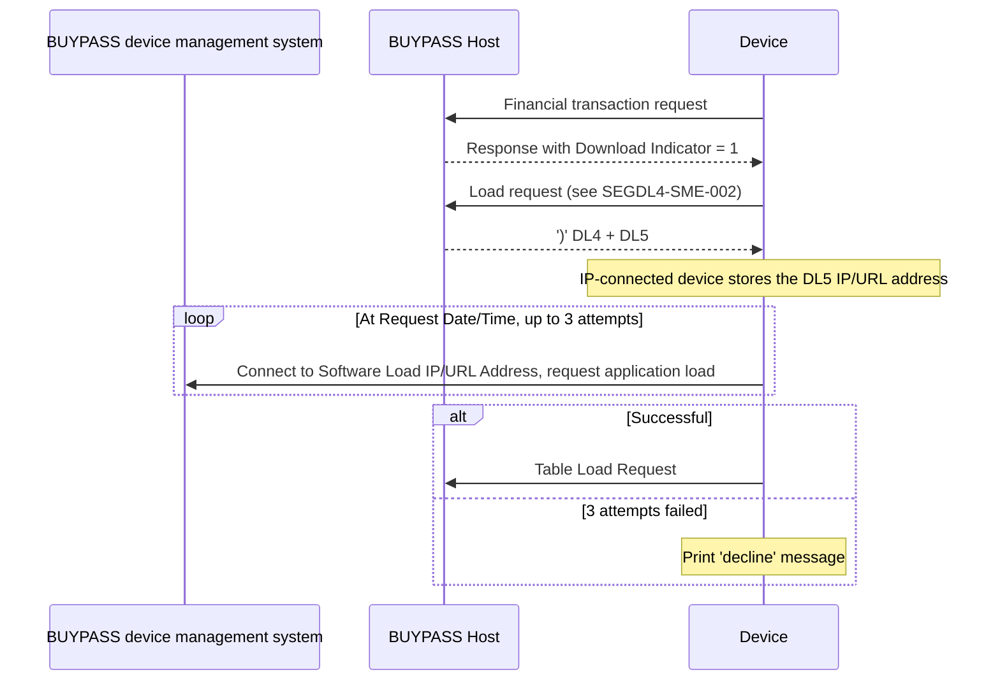

# Segment DL5 Lifecycle, Response and Message Correlation Flow

Rules: `SEGDL5-R-006`, `SEGDL5-R-007`. Full step table: [DL4 lifecycle note](../segment-DL4/lifecycle-response-correlation-sme-tba-note.md).

Source: [segment-DL5-rule-catalog.json](coverage/segment-DL5-rule-catalog.json) · Note: [lifecycle-response-correlation-sme-tba-note.md](lifecycle-response-correlation-sme-tba-note.md)
