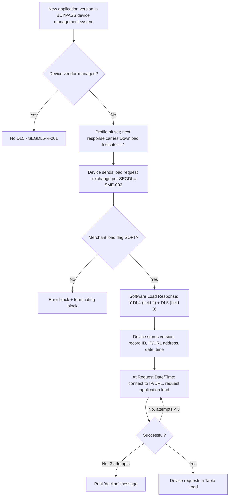
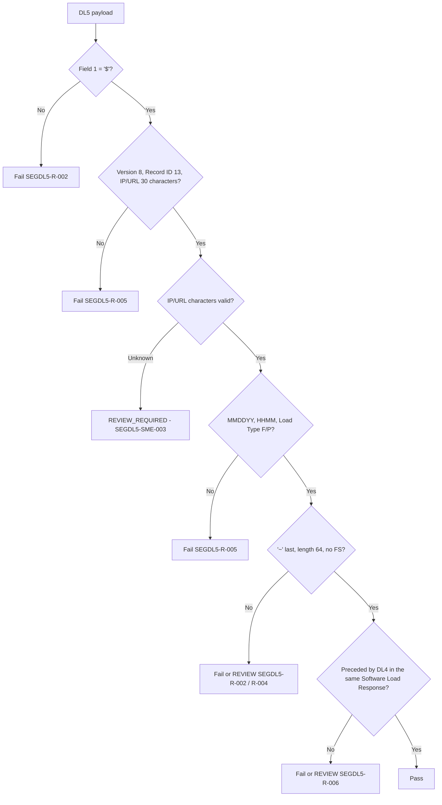

# Segment DL5 End-to-End Flow

```mermaid
flowchart TD
    A[New application version in BUYPASS device management system] --> B{Device vendor-managed?}
    B -->|Yes| N1[No DL5 - SEGDL5-R-001]
    B -->|No| C[Profile bit set; next response carries Download Indicator = 1]
    C --> D[Device sends load request - exchange per SEGDL4-SME-002]
    D --> E{Merchant load flag SOFT?}
    E -->|No| N2[Error block + terminating block]
    E -->|Yes| F["Software Load Response: ')' DL4 (field 2) + DL5 (field 3)"]
    F --> G[Device stores version, record ID, IP/URL address, date, time]
    G --> H[At Request Date/Time: connect to IP/URL, request application load]
    H --> I{Successful?}
    I -->|No, attempts < 3| H
    I -->|No, 3 attempts| J[Print 'decline' message]
    I -->|Yes| K[Device requests a Table Load]
```

## Validator Decision Flow (`SegmentDL5PayloadValidator`, planned)

```mermaid
flowchart TD
    P[DL5 payload] --> V1{"Field 1 = '$'?"}
    V1 -->|No| X2[Fail SEGDL5-R-002]
    V1 -->|Yes| V2{Version 8, Record ID 13, IP/URL 30 characters?}
    V2 -->|No| X5[Fail SEGDL5-R-005]
    V2 -->|Yes| V3{IP/URL characters valid?}
    V3 -->|Unknown| R3[REVIEW_REQUIRED - SEGDL5-SME-003]
    V3 -->|Yes| V4{MMDDYY, HHMM, Load Type F/P?}
    V4 -->|No| X5b[Fail SEGDL5-R-005]
    V4 -->|Yes| V5{"'~' last, length 64, no FS?"}
    V5 -->|No| X2b[Fail or REVIEW SEGDL5-R-002 / R-004]
    V5 -->|Yes| V6{Preceded by DL4 in the same Software Load Response?}
    V6 -->|No| X6[Fail or REVIEW SEGDL5-R-006]
    V6 -->|Yes| OK[Pass]
```
