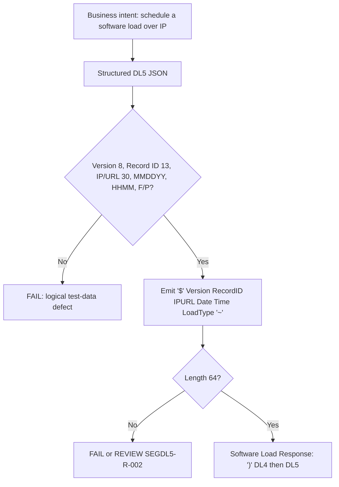

# Segment DL5 Serialization and Wire-Format Flow



Synthetic example, 64 characters (address letters/digits only, space-padded — padding assumed, `SEGDL5-SME-003`):

```text
$APP02.10STR0000000123DMSHOST01                     1015260200F~
```
