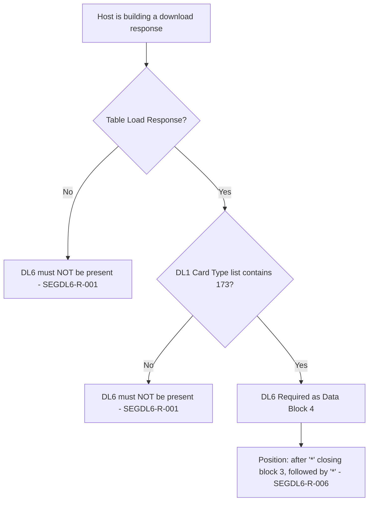

# Segment DL6 Applicability and Message-Family Decision Flow

| Message | DL6 | Evidence |
|---|---|---|
| Table Load Response with DL1 `173` | **Required** (layout says C, condition = `173`) | 11.7.1.2 field 8; 12.47 note |
| Table Load Response without `173` | Not allowed | 12.47 note ("only sent … when") |
| Any other message | Not allowed | Chapter 12 matrix |

Source: [segment-DL6-rule-catalog.json](coverage/segment-DL6-rule-catalog.json) · Note: [applicability-decision-sme-tba-note.md](applicability-decision-sme-tba-note.md)
