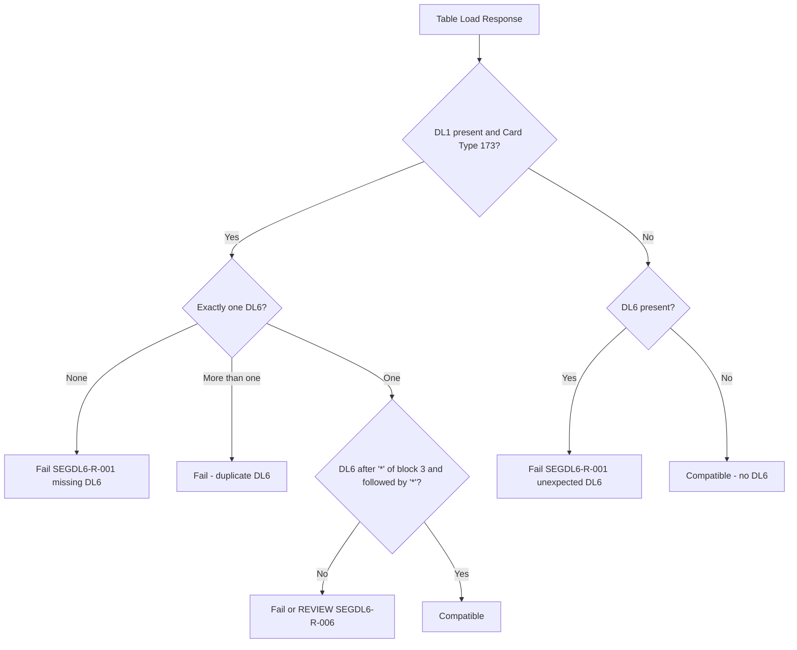

# Segment DL6 Companion-Segment Compatibility Decision Flow

```mermaid
flowchart TD
    A[Table Load Response] --> B{DL1 present and Card Type 173?}
    B -->|Yes| C{Exactly one DL6?}
    C -->|None| X1[Fail SEGDL6-R-001 missing DL6]
    C -->|More than one| X2[Fail - duplicate DL6]
    C -->|One| D{"DL6 after '*' of block 3 and followed by '*'?"}
    D -->|No| X3[Fail or REVIEW SEGDL6-R-006]
    D -->|Yes| OK[Compatible]
    B -->|No| E{DL6 present?}
    E -->|Yes| X4[Fail SEGDL6-R-001 unexpected DL6]
    E -->|No| OK2[Compatible - no DL6]
```
