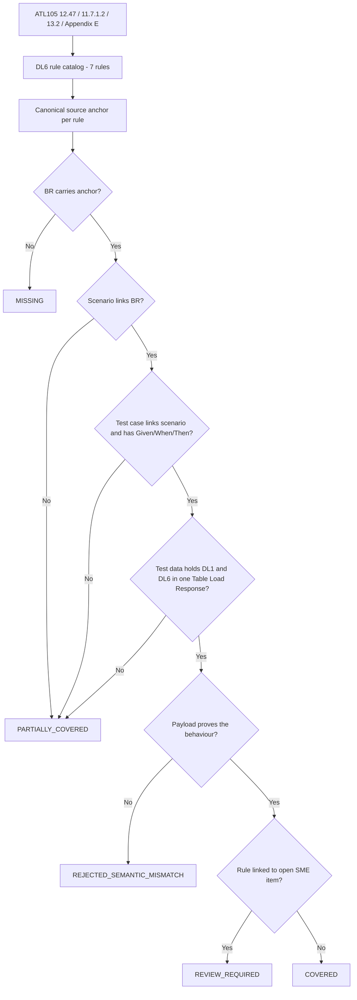

# Segment DL6 Coverage Closure Flow

```mermaid
flowchart TD
    A[ATL105 12.47 / 11.7.1.2 / 13.2 / Appendix E] --> B[DL6 rule catalog - 7 rules]
    B --> C[Canonical source anchor per rule]
    C --> D{BR carries anchor?}
    D -->|No| M[MISSING]
    D -->|Yes| E{Scenario links BR?}
    E -->|No| P[PARTIALLY_COVERED]
    E -->|Yes| F{Test case links scenario and has Given/When/Then?}
    F -->|No| P
    F -->|Yes| G{Test data holds DL1 and DL6 in one Table Load Response?}
    G -->|No| P
    G -->|Yes| H{Payload proves the behaviour?}
    H -->|No| S[REJECTED_SEMANTIC_MISMATCH]
    H -->|Yes| I{Rule linked to open SME item?}
    I -->|Yes| R[REVIEW_REQUIRED]
    I -->|No| J[COVERED]
```

Rules currently `REVIEW_REQUIRED` by design: `SEGDL6-R-002` (P-03, P-04), `R-003` (P-01), `R-006` (`SEGDL1-SME-003`), `R-007` (P-05).
