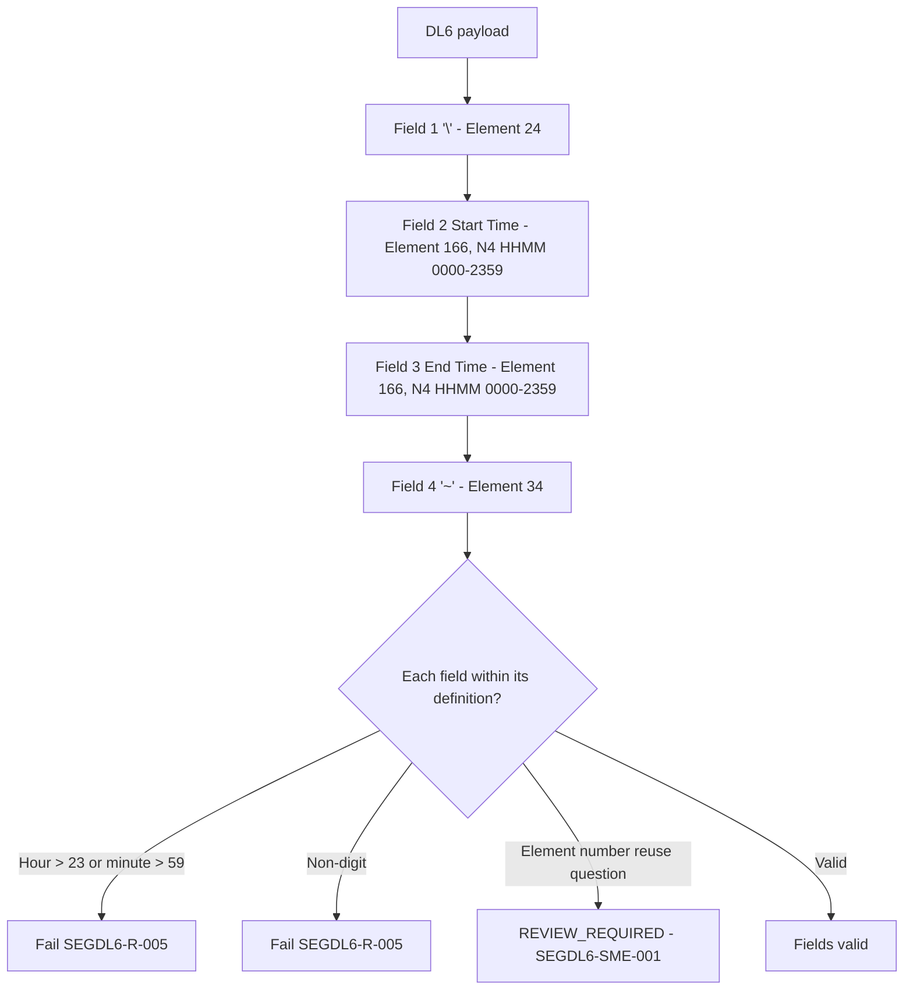

# Segment DL6 Field Definitions and Element Semantics Flow

Source: [segment-DL6-rule-catalog.json](coverage/segment-DL6-rule-catalog.json) · Note: [field-definitions-sme-tba-note.md](field-definitions-sme-tba-note.md)
