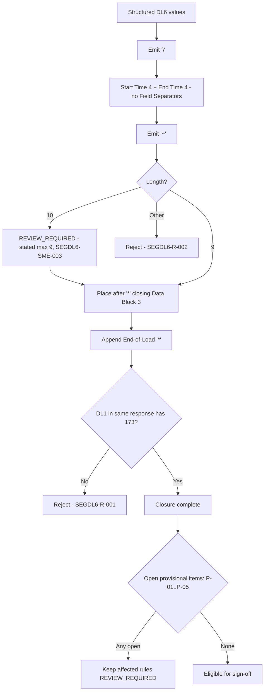

# Segment DL6 Final Closure Flow

```mermaid
flowchart TD
    A[Structured DL6 values] --> B["Emit '\'"]
    B --> C[Start Time 4 + End Time 4 - no Field Separators]
    C --> D["Emit '~'"]
    D --> E{Length?}
    E -->|10| R1[REVIEW_REQUIRED - stated max 9, SEGDL6-SME-003]
    E -->|Other| X1[Reject - SEGDL6-R-002]
    R1 --> F
    E -->|9| F[Place after '*' closing Data Block 3]
    F --> G["Append End-of-Load '*'"]
    G --> H{DL1 in same response has 173?}
    H -->|No| X2[Reject - SEGDL6-R-001]
    H -->|Yes| Z[Closure complete]
    Z --> P{Open provisional items: P-01..P-05}
    P -->|Any open| R[Keep affected rules REVIEW_REQUIRED]
    P -->|None| S[Eligible for sign-off]
```

A 9-character DL6 cannot hold `\` + 4 + 4 + `~`; the "9" branch exists only if the SME confirms a different layout.
