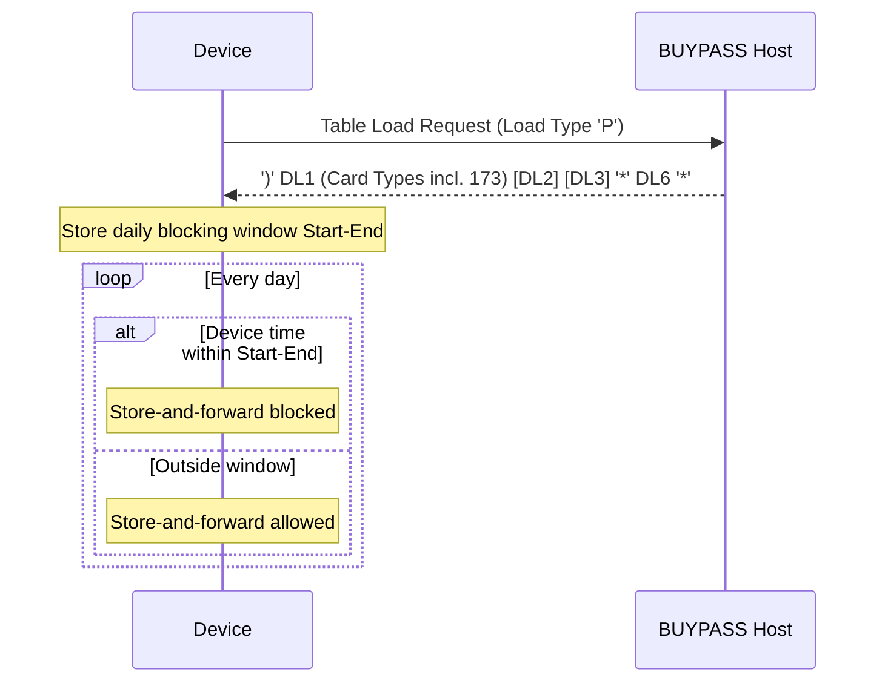

# Segment DL6 Lifecycle, Response and Message Correlation Flow

Rules: `SEGDL6-R-001`, `SEGDL6-R-006`, `SEGDL6-R-007`. Open: `SEGDL6-SME-005`, `SEGDL1-SME-003`.

Source: [segment-DL6-rule-catalog.json](coverage/segment-DL6-rule-catalog.json) · Note: [lifecycle-response-correlation-sme-tba-note.md](lifecycle-response-correlation-sme-tba-note.md)
