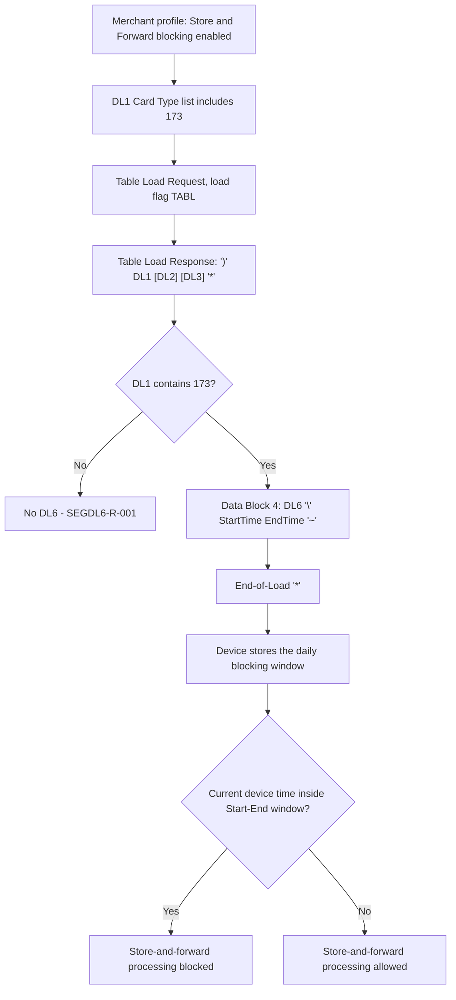
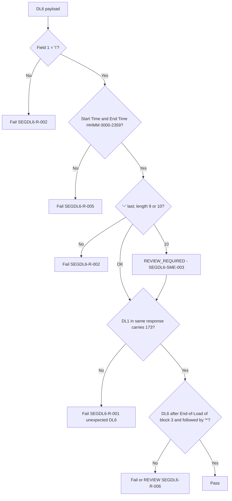

# Segment DL6 End-to-End Flow

```mermaid
flowchart TD
    A[Merchant profile: Store and Forward blocking enabled] --> B[DL1 Card Type list includes 173]
    B --> C[Table Load Request, load flag TABL]
    C --> D["Table Load Response: ')' DL1 [DL2] [DL3] '*'"]
    D --> E{DL1 contains 173?}
    E -->|No| N1[No DL6 - SEGDL6-R-001]
    E -->|Yes| F["Data Block 4: DL6 '\' StartTime EndTime '~'"]
    F --> G["End-of-Load '*'"]
    G --> H[Device stores the daily blocking window]
    H --> I{Current device time inside Start-End window?}
    I -->|Yes| J[Store-and-forward processing blocked]
    I -->|No| K[Store-and-forward processing allowed]
```

## Validator Decision Flow (`SegmentDL6PayloadValidator`, planned)

```mermaid
flowchart TD
    P[DL6 payload] --> V1{"Field 1 = '\'?"}
    V1 -->|No| X2[Fail SEGDL6-R-002]
    V1 -->|Yes| V2{Start Time and End Time HHMM 0000-2359?}
    V2 -->|No| X5[Fail SEGDL6-R-005]
    V2 -->|Yes| V3{"'~' last; length 9 or 10?"}
    V3 -->|No| X2b[Fail SEGDL6-R-002]
    V3 -->|10| R3[REVIEW_REQUIRED - SEGDL6-SME-003]
    V3 -->|OK| V4{DL1 in same response carries 173?}
    R3 --> V4
    V4 -->|No| X1[Fail SEGDL6-R-001 unexpected DL6]
    V4 -->|Yes| V5{DL6 after End-of-Load of block 3 and followed by '*'?}
    V5 -->|No| X6[Fail or REVIEW SEGDL6-R-006]
    V5 -->|Yes| OK[Pass]
```
