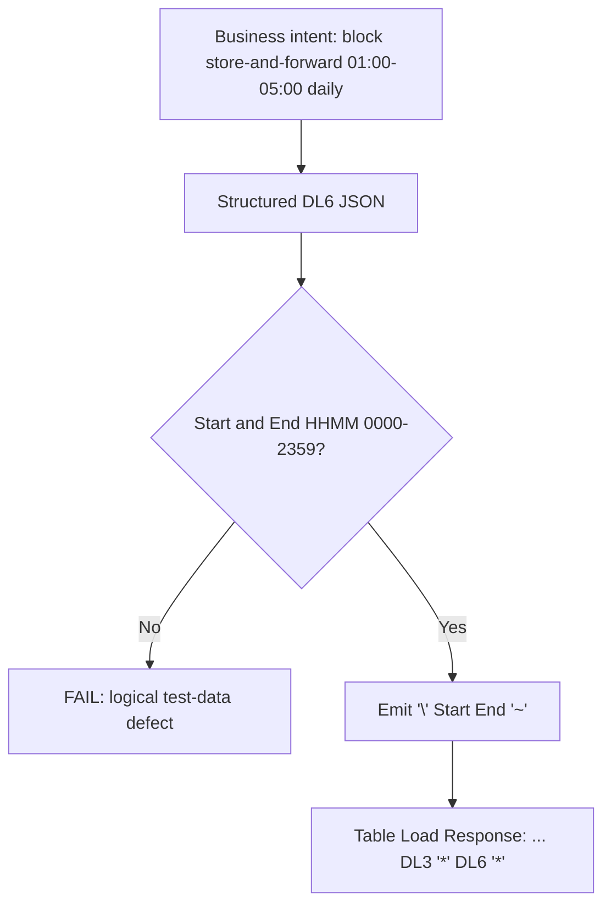

# Segment DL6 Serialization and Wire-Format Flow


```mermaid
flowchart TD
    A[Business intent: block store-and-forward 01:00-05:00 daily] --> B[Structured DL6 JSON]
    B --> C{Start and End HHMM 0000-2359?}
    C -->|No| X1[FAIL: logical test-data defect]
    C -->|Yes| D["Emit '\' Start End '~'"]
    D --> E["Table Load Response: ... DL3 '*' DL6 '*'"]
```

Synthetic example, 10 characters (stated maximum 9 — `SEGDL6-SME-003`):

```text
\01000500~
```
