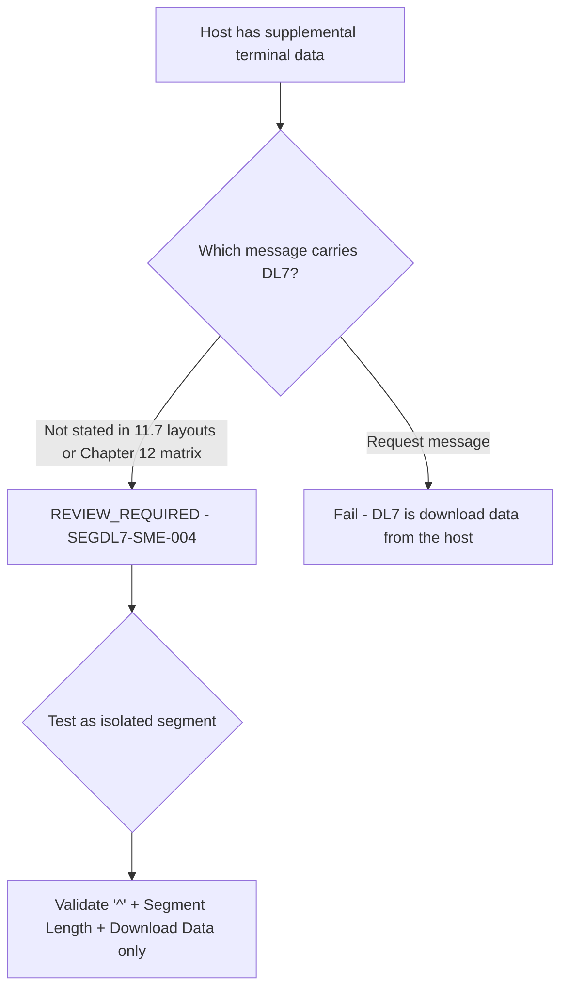

# Segment DL7 Applicability and Message-Family Decision Flow

| Evidence | What it says about placement |
|---|---|
| 12.48 | Layout only; no message named |
| Element 24 | `^` identifies DL7 in "a host response" |
| 11.7.1.2 Table Load Response | Lists DL1, DL2, DL3, DL6 only |
| Chapter 12 matrix | Lists DL1-DL6 only |

Source: [segment-DL7-rule-catalog.json](coverage/segment-DL7-rule-catalog.json) · Note: [applicability-decision-sme-tba-note.md](applicability-decision-sme-tba-note.md)
