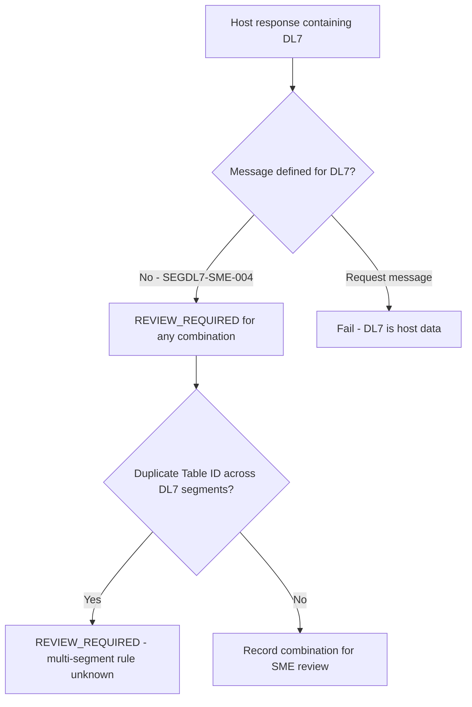

# Segment DL7 Companion-Segment Compatibility Decision Flow

```mermaid
flowchart TD
    A[Host response containing DL7] --> B{Message defined for DL7?}
    B -->|No - SEGDL7-SME-004| R1[REVIEW_REQUIRED for any combination]
    B -->|Request message| X1[Fail - DL7 is host data]
    R1 --> C{Duplicate Table ID across DL7 segments?}
    C -->|Yes| R2[REVIEW_REQUIRED - multi-segment rule unknown]
    C -->|No| D[Record combination for SME review]
```

DL7 has no trigger from, and triggers no, other segment. It shares its hybrid framing with DL8.
