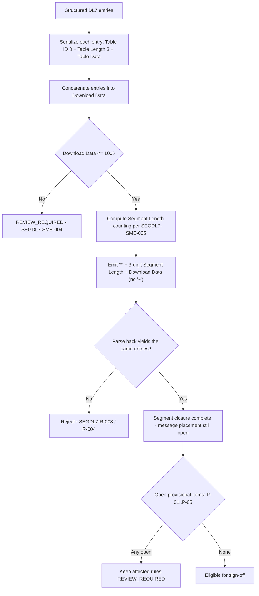

# Segment DL7 Final Closure Flow

```mermaid
flowchart TD
    A[Structured DL7 entries] --> B[Serialize each entry: Table ID 3 + Table Length 3 + Table Data]
    B --> C[Concatenate entries into Download Data]
    C --> D{Download Data <= 100?}
    D -->|No| R1[REVIEW_REQUIRED - SEGDL7-SME-004]
    D -->|Yes| E[Compute Segment Length - counting per SEGDL7-SME-005]
    E --> F["Emit '^' + 3-digit Segment Length + Download Data (no '~')"]
    F --> G{Parse back yields the same entries?}
    G -->|No| X1[Reject - SEGDL7-R-003 / R-004]
    G -->|Yes| Z[Segment closure complete - message placement still open]
    Z --> P{Open provisional items: P-01..P-05}
    P -->|Any open| R[Keep affected rules REVIEW_REQUIRED]
    P -->|None| S[Eligible for sign-off]
```
