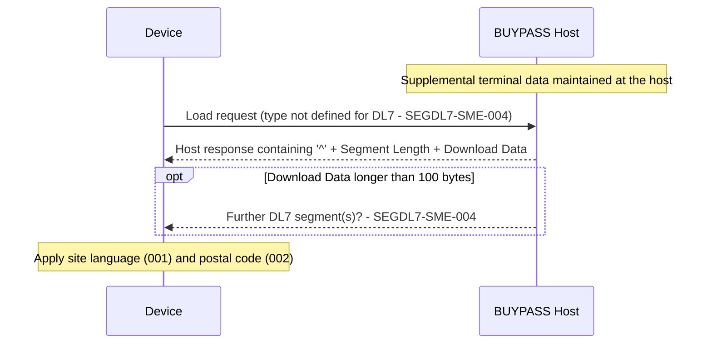

# Segment DL7 Lifecycle, Response and Message Correlation Flow

No catalogued lifecycle rule exists yet; the exchange is open under `SEGDL7-SME-004`.

Source: [segment-DL7-rule-catalog.json](coverage/segment-DL7-rule-catalog.json) · Note: [lifecycle-response-correlation-sme-tba-note.md](lifecycle-response-correlation-sme-tba-note.md)
