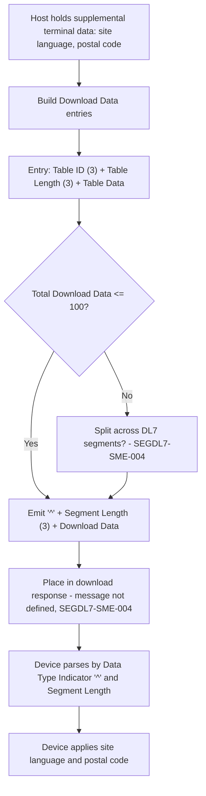
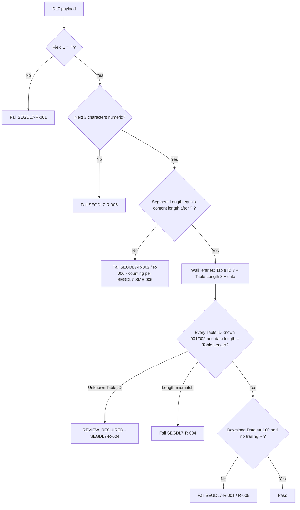

# Segment DL7 End-to-End Flow

```mermaid
flowchart TD
    A[Host holds supplemental terminal data: site language, postal code] --> B[Build Download Data entries]
    B --> C["Entry: Table ID (3) + Table Length (3) + Table Data"]
    C --> D{Total Download Data <= 100?}
    D -->|No| E[Split across DL7 segments? - SEGDL7-SME-004]
    D -->|Yes| F["Emit '^' + Segment Length (3) + Download Data"]
    E --> F
    F --> G[Place in download response - message not defined, SEGDL7-SME-004]
    G --> H[Device parses by Data Type Indicator '^' and Segment Length]
    H --> I[Device applies site language and postal code]
```

## Validator Decision Flow (`SegmentDL7PayloadValidator`, planned)

```mermaid
flowchart TD
    P[DL7 payload] --> V1{"Field 1 = '^'?"}
    V1 -->|No| X1[Fail SEGDL7-R-001]
    V1 -->|Yes| V2{Next 3 characters numeric?}
    V2 -->|No| X6[Fail SEGDL7-R-006]
    V2 -->|Yes| V3{Segment Length equals content length after '^'?}
    V3 -->|No| X2[Fail SEGDL7-R-002 / R-006 - counting per SEGDL7-SME-005]
    V3 -->|Yes| V4[Walk entries: Table ID 3 + Table Length 3 + data]
    V4 --> V5{Every Table ID known 001/002 and data length = Table Length?}
    V5 -->|Unknown Table ID| R1[REVIEW_REQUIRED - SEGDL7-R-004]
    V5 -->|Length mismatch| X4[Fail SEGDL7-R-004]
    V5 -->|Yes| V6{Download Data <= 100 and no trailing '~'?}
    V6 -->|No| X5[Fail SEGDL7-R-001 / R-005]
    V6 -->|Yes| OK[Pass]
```
