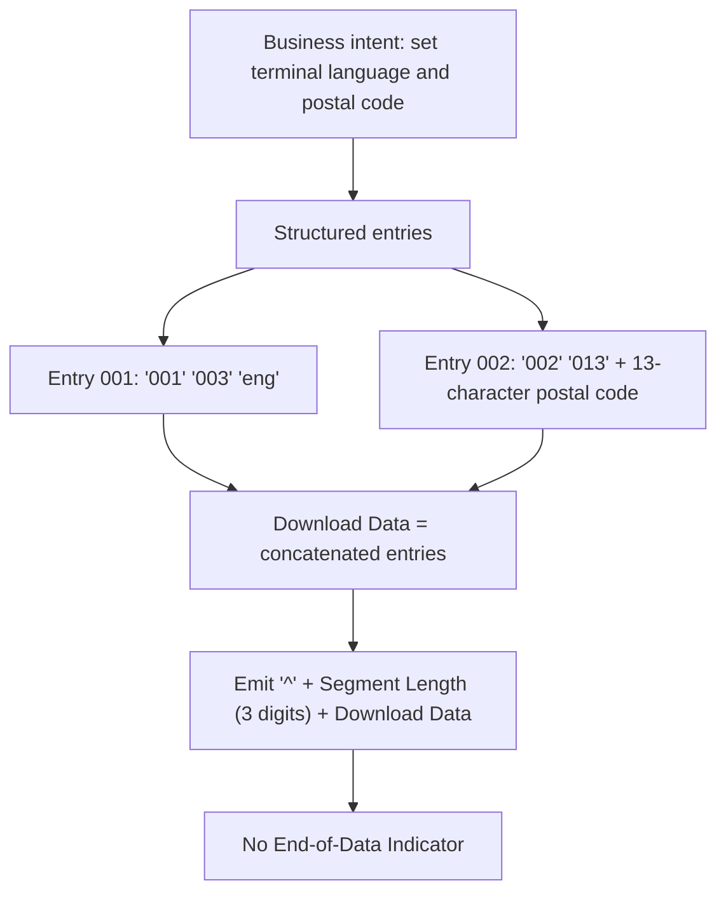

# Segment DL7 Serialization and Wire-Format Flow



Synthetic example (Segment Length counting Download Data only — one of the two readings in `SEGDL7-SME-005`), 32 characters; the postal code `A1B 2C3` is followed by six spaces to fill its 13 characters:

```text
^028001003eng002013A1B 2C3      
```
