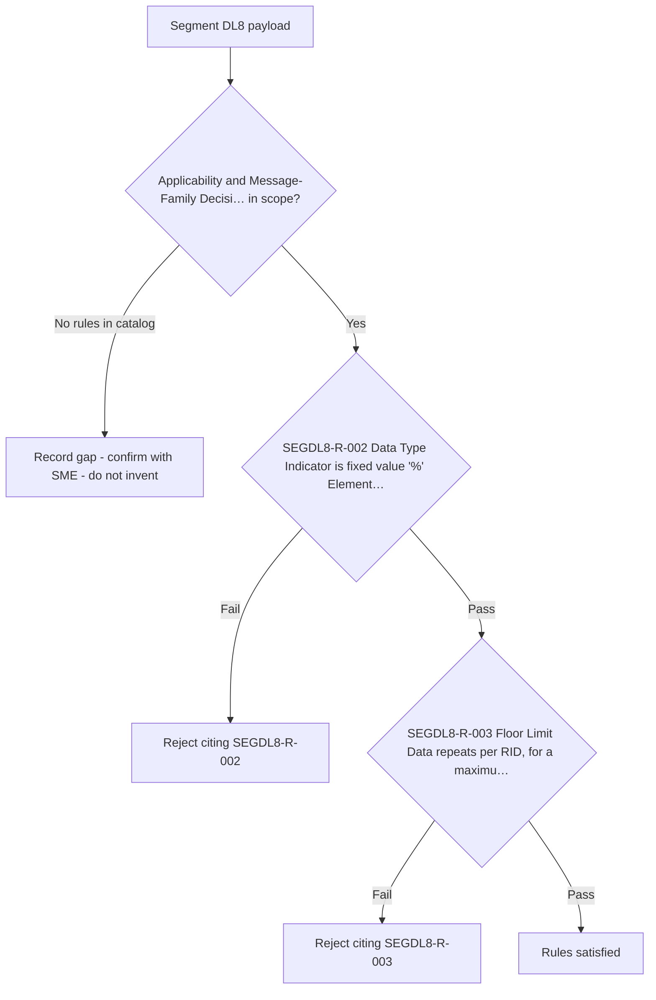

# Segment DL8 Applicability and Message-Family Decision Flow

Rules are evaluated in catalog order. Provisional rules are shown with a dotted branch: they are documented but must not be certified as covered until the linked SME item is resolved.

Source: [segment-DL8-rule-catalog.json](coverage/segment-DL8-rule-catalog.json) · Note: [applicability-decision-sme-tba-note.md](applicability-decision-sme-tba-note.md)
