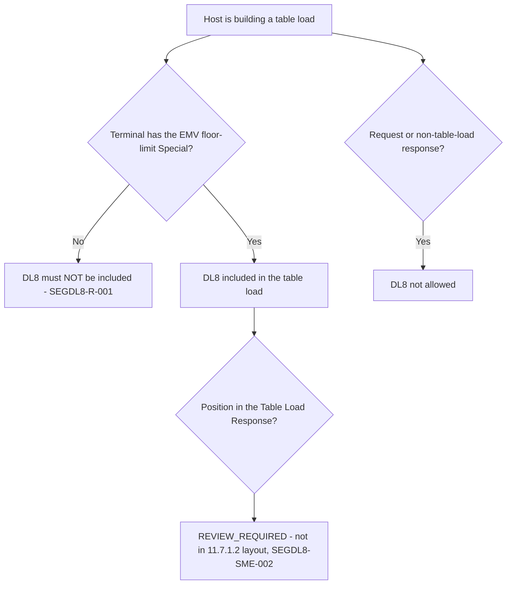

# Segment DL8 Applicability and Message-Family Decision Flow

| Evidence | What it says |
|---|---|
| 12.49 | "Inclusion of this segment in a table load will be dependent on a Special set at the terminal level" |
| Element 24 | `%` identifies DL8 in a host response |
| 11.7.1.2 | Table Load Response layout lists DL1, DL2, DL3, DL6 only |
| Chapter 12 matrix | DL1-DL6 only |

Source: [segment-DL8-rule-catalog.json](coverage/segment-DL8-rule-catalog.json) · Note: [applicability-decision-sme-tba-note.md](applicability-decision-sme-tba-note.md)
