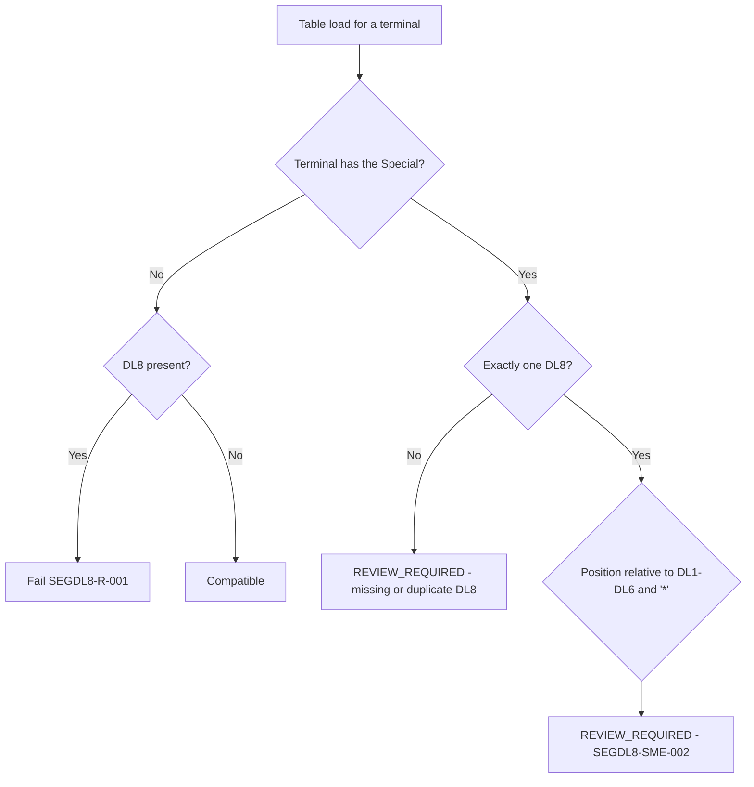

# Segment DL8 Companion-Segment Compatibility Decision Flow

DL8 has no trigger from another segment's value. It shares its framing with DL7 and relates semantically to EMV transactions (Segment 130), which it does not accompany in any message.
