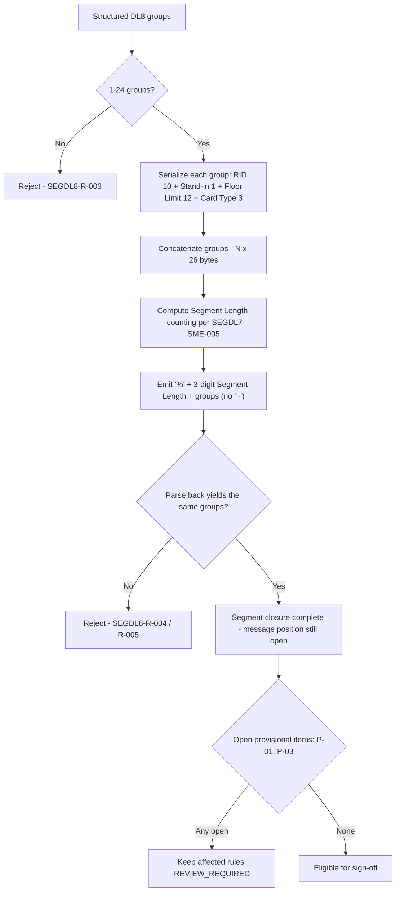

# Segment DL8 Final Closure Flow

```mermaid
flowchart TD
    A[Structured DL8 groups] --> B{1-24 groups?}
    B -->|No| X1[Reject - SEGDL8-R-003]
    B -->|Yes| C[Serialize each group: RID 10 + Stand-in 1 + Floor Limit 12 + Card Type 3]
    C --> D[Concatenate groups - N x 26 bytes]
    D --> E[Compute Segment Length - counting per SEGDL7-SME-005]
    E --> F["Emit '%' + 3-digit Segment Length + groups (no '~')"]
    F --> G{Parse back yields the same groups?}
    G -->|No| X2[Reject - SEGDL8-R-004 / R-005]
    G -->|Yes| Z[Segment closure complete - message position still open]
    Z --> P{Open provisional items: P-01..P-03}
    P -->|Any open| R[Keep affected rules REVIEW_REQUIRED]
    P -->|None| S[Eligible for sign-off]
```
