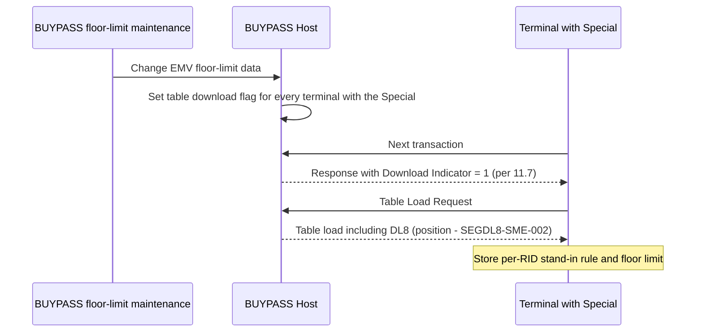

# Segment DL8 Lifecycle, Response and Message Correlation Flow

Rules: `SEGDL8-R-001`. The Download Indicator step is inferred from 11.7 and is `REVIEW_REQUIRED` for DL8.

Source: [segment-DL8-rule-catalog.json](coverage/segment-DL8-rule-catalog.json) · Note: [lifecycle-response-correlation-sme-tba-note.md](lifecycle-response-correlation-sme-tba-note.md)
