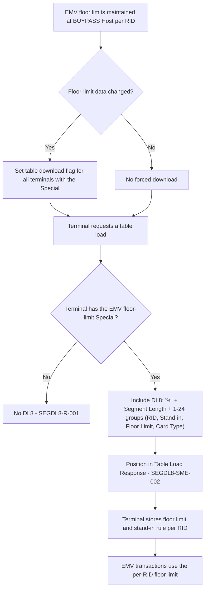
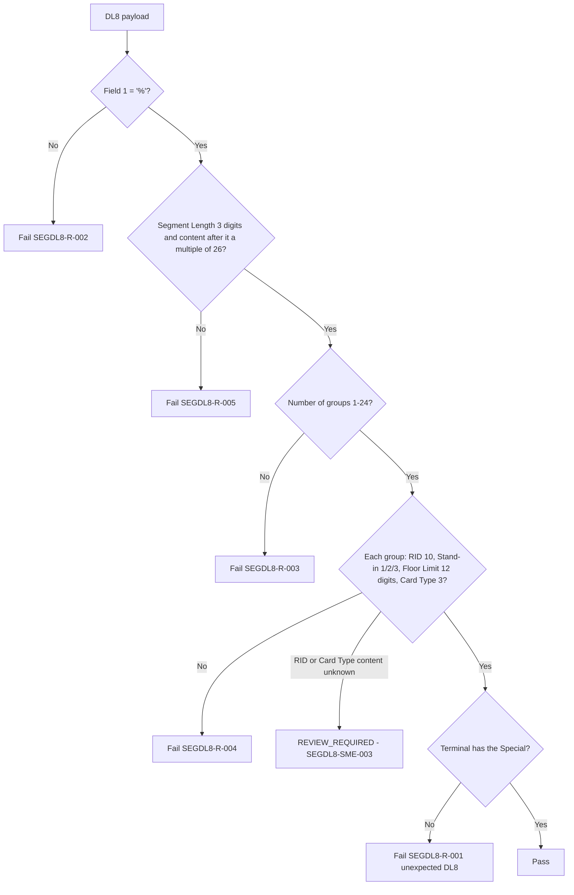

# Segment DL8 End-to-End Flow

```mermaid
flowchart TD
    A[EMV floor limits maintained at BUYPASS Host per RID] --> B{Floor-limit data changed?}
    B -->|Yes| C[Set table download flag for all terminals with the Special]
    B -->|No| D[No forced download]
    C --> E[Terminal requests a table load]
    D --> E
    E --> F{Terminal has the EMV floor-limit Special?}
    F -->|No| N1[No DL8 - SEGDL8-R-001]
    F -->|Yes| G["Include DL8: '%' + Segment Length + 1-24 groups (RID, Stand-in, Floor Limit, Card Type)"]
    G --> H[Position in Table Load Response - SEGDL8-SME-002]
    H --> I[Terminal stores floor limit and stand-in rule per RID]
    I --> J[EMV transactions use the per-RID floor limit]
```

## Validator Decision Flow (`SegmentDL8PayloadValidator`, planned)

```mermaid
flowchart TD
    P[DL8 payload] --> V1{"Field 1 = '%'?"}
    V1 -->|No| X2[Fail SEGDL8-R-002]
    V1 -->|Yes| V2{Segment Length 3 digits and content after it a multiple of 26?}
    V2 -->|No| X5[Fail SEGDL8-R-005]
    V2 -->|Yes| V3{Number of groups 1-24?}
    V3 -->|No| X3[Fail SEGDL8-R-003]
    V3 -->|Yes| V4{Each group: RID 10, Stand-in 1/2/3, Floor Limit 12 digits, Card Type 3?}
    V4 -->|No| X4[Fail SEGDL8-R-004]
    V4 -->|RID or Card Type content unknown| R4[REVIEW_REQUIRED - SEGDL8-SME-003]
    V4 -->|Yes| V5{Terminal has the Special?}
    V5 -->|No| X1[Fail SEGDL8-R-001 unexpected DL8]
    V5 -->|Yes| OK[Pass]
```
