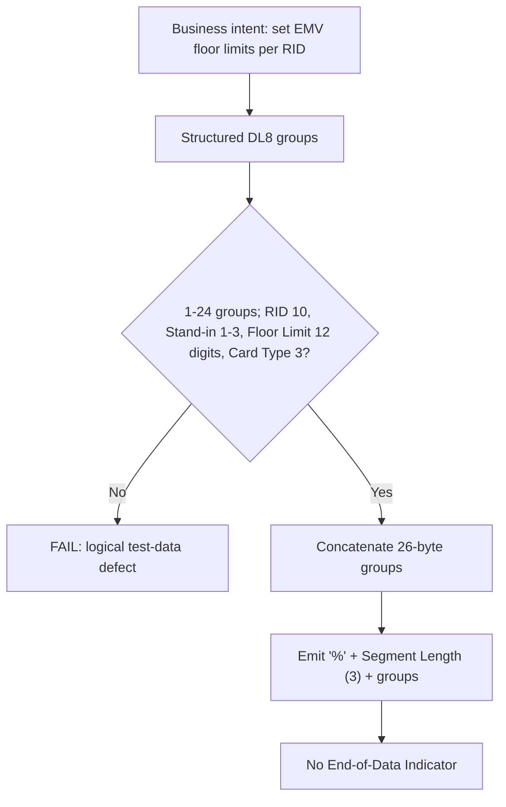

# Segment DL8 Serialization and Wire-Format Flow



Synthetic example, two groups (Segment Length counting group data only — one reading of `SEGDL7-SME-005`), 56 characters:

```text
%052A0000000033000000005000020A0000000042000000002500020
```

| Group | RID | Stand-in | Floor Limit | Card Type |
|---|---|---|---|---|
| 1 | `A000000003` | `3` | `000000005000` | `020` |
| 2 | `A000000004` | `2` | `000000002500` | `020` |
