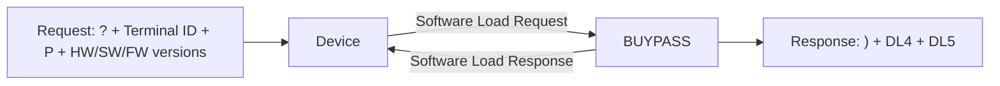

# Software Load Message Templates

**Specification:** ATL105 2026-3, Section 11.7.4 (pages 11-34 to 11-35)
**Purpose:** Dedicated training module for the Software Load request and response envelopes.

## Message Pair

## Request

A positional message with no Field Separators:

| Position | Element | Rule |
|---:|---:|---|
| 1 | 44 Information Byte | Required, fixed `?` |
| 2 | 102 Terminal Identifier | Required, 13 alphanumeric characters |
| 3 | 48 Load Type | Required, fixed `P` for Partial Load |
| 4 | 43 Hardware Version | Required, 4 characters |
| 5 | 96 Software Version | Required, 8 characters |
| 6 | 39 Firmware Version | Required, 8 characters |

The merchant load flag must be `SOFT`; this is an operational prerequisite, not a field in the positional message.

## Response

A positional response with one start-of-data indicator and one data block:

- Start-of-Data Block Indicator: fixed `)`.
- DL4 Software Dial Load Data Segment: required, maximum 52 characters.
- DL5 Software IP Load Data Segment: required, maximum 66 characters.
- No Field Separators.

DL4 and DL5 are distinct self-delimited segment formats. DL4 uses Data Type Indicator `@`; DL5 uses Data Type Indicator `$`; both end with `~`. They are mutually exclusive delivery mechanisms within the segment content, but the Section 11.7.4 response table requires both response entries.

## Training Status

| Gate | Status |
|---|---|
| PDF layout cross-check | COMPLETE |
| Positional request/response template | COMPLETE |
| Independent validator and fixtures | COMPLETE |
| AI BR -> TS -> TC -> TD -> mapping comparison | PENDING |
| SME operational approval | REVIEW_REQUIRED |

## Source Evidence

- ATL105 Section 11.7.4.1, PDF page 11-34: request layout.
- ATL105 Section 11.7.4.2, PDF page 11-35: response layout.
- Segment DL4 Section 12.45 knowledge module.
- Segment DL5 Section 12.46 knowledge module.

## Scope Boundary

This module does not certify vendor-managed device applicability, the `SOFT` merchant load-flag administration, or the external TransArmor specification. Those require separate evidence.
