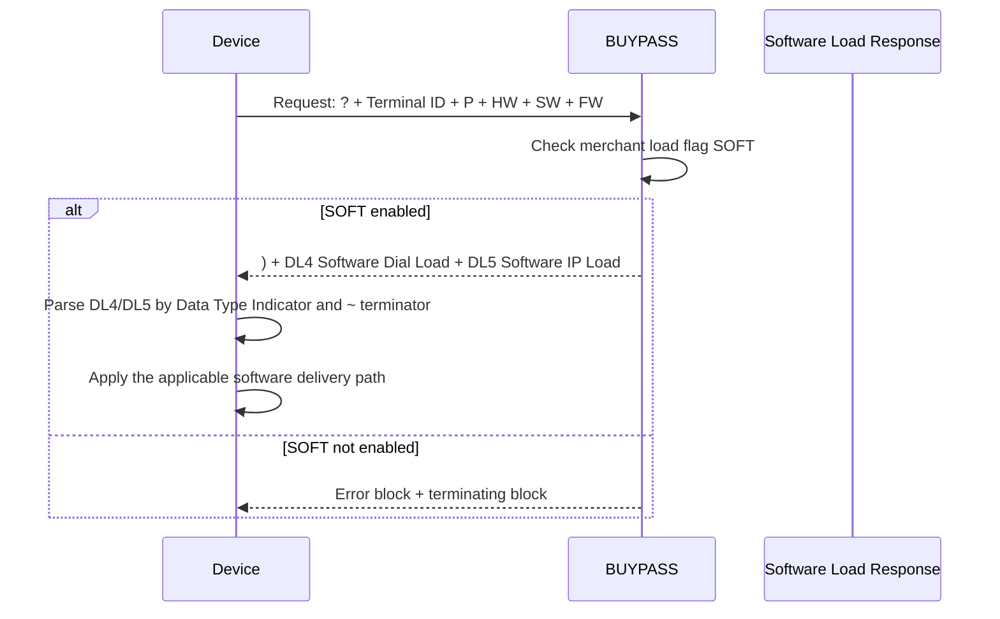

# Software Load Flow

## Message Shape

The request is positional and contains no Field Separators. It has no `MessageType`, `NumSegments`, Segment 100, or Segment 120 object.

The response begins with `)` and carries the DL4 and DL5 response blocks. DL4 and DL5 are self-delimited by their own Data Type Indicator and End-of-Data Indicator. The validator checks the envelope and block presence; field-level DL4/DL5 validation remains owned by their segment modules.
