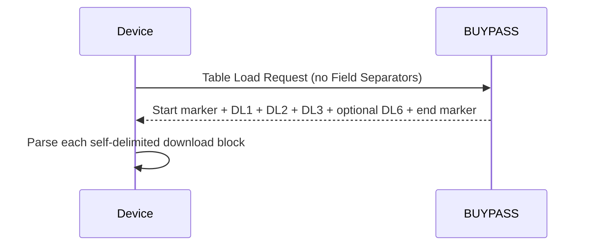

# Table Load Message Templates

**Specification:** ATL105 2026-3, Section 11.7.1

## Flow

## Understanding

The request is positional: Information Byte `?`, 13-character Terminal Identifier, Load Type `P`, Hardware Version, Software Version and Firmware Version. The response contains DL1 Merchant Data, DL2 Dial String Data and DL3 Date and Time Data. DL6 Store and Forward Data is conditional when DL1 contains Card Type `173`. The response uses download block indicators and no Field Separators.

The independent `TableLoadPayloadValidator` checks the envelope and block presence. DL1-DL6 field rules remain owned by their segment modules.
