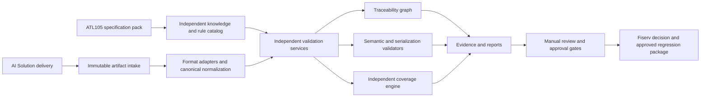
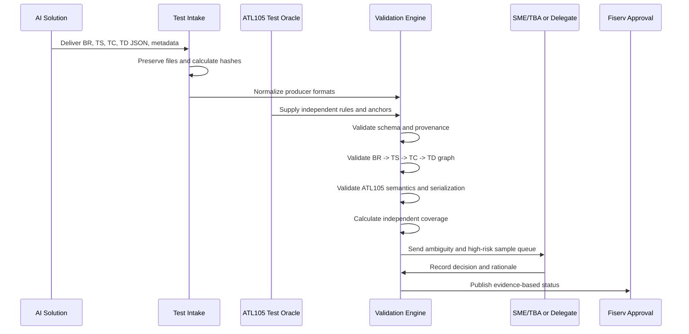

# Core Auth Test Solution Architecture

## Fiserv Management Briefing

**Current specification pack:** BUYPASS ATL105 2026-3  
**Current proof points:** Segment 100 through Segment 120 modules  
**Audience:** Fiserv Management, Business/Development, Test Leadership, AI Solution Team

## 1. Executive Position

The Core Auth Test Solution is an independent quality and evidence platform between AI-generated test artifacts and business-approved regression testing.

It does not trust AI-produced requirements, scenarios, test cases, data, approval labels, or coverage percentages as truth. It preserves the AI delivery, derives an independent Test Solution baseline from ATL105, validates both structures and business meaning, and produces an auditable decision:

```text
AI Solution artifacts
        |
        v
Independent intake and normalization
        |
        v
Test Solution rule oracle and canonical model
        |
        v
BR -> TS -> TC -> request Test Data JSON validation
        |
        v
Coverage, traceability, defects, and review queue
        |
        v
Fiserv approval decision
```

## 2. Business Outcome

The architecture gives Fiserv a controlled answer to four management questions:

| Management question | Test Solution answer |
| --- | --- |
| Can valid JSON still be wrong? | Yes. Structural, semantic, source, lifecycle, and serialization checks are independent. |
| How do we know AI coverage is real? | Coverage is recalculated against Test Solution-owned ATL105 rule catalogs. |
| What happens when AI and Test artifacts differ? | Differences are classified as confirmed, review-required, missing, extra, or contradictory. |
| Can the result be audited? | Yes. Original inputs, source anchors, versions, decisions, reports, and evidence are retained. |

## 3. Architecture Principles

1. **Independence:** Test Solution rules are derived from ATL105 knowledge, not copied from AI output.
2. **Canonical identity:** Source anchors provide semantic identity when AI and Test IDs differ.
3. **Evidence before approval:** Confidence, similarity, and producer approval labels do not create confirmed coverage.
4. **Full-chain validation:** A BR is not fully covered unless the linked TS, TC, and request Test Data JSON are valid and executable or explicitly review-gated.
5. **Specification-pack reuse:** ATL105-specific rules live in the specification pack; reusable validation services remain specification-independent.
6. **Human control:** Ambiguity, provisional interpretations, and high-risk samples remain visible for SME/TBA or delegated approval.
7. **Immutable intake:** AI input is preserved byte-for-byte and never silently repaired in place.

## 4. Logical Architecture



## 5. Core Components

### 5.1 Specification Pack

The ATL105 pack is the authoritative Test Solution knowledge boundary:

```text
specifications/ATL105/
  contract/       aliases and specification-specific contract extensions
  docs/           source, knowledge base, strategy, and governance
  reports/        retained stakeholder and legacy reference reports
  schemas/        ATL105 JSON schemas
  scripts/        ATL105-specific generators and report scripts
  test-input/     immutable AI runs and controlled Test Solution fixtures
  test-output/    independent baselines, reports, and evidence
```

It contains source anchors, segment rule catalogs, field rules, code tables, lifecycle rules, companion-segment rules, serialization rules, and coverage profiles.

### 5.2 Immutable AI Intake

AI artifacts are stored under:

```text
specifications/ATL105/test-input/ai-solution/runs/<date>/<run>/
```

The intake layer records provenance, hashes, source version, producer metadata, and run identity. It does not edit the original AI files.

### 5.3 Canonical Model

Adapters normalize different producer formats into common artifact types:

```text
CanonicalRequirement
CanonicalScenario
CanonicalTestCase
CanonicalTestData
SourceAnchor
PackageManifest
```

Producer-local IDs remain available for audit, but matching is based on canonical ATL105 anchors and validated business context.

### 5.4 Independent Rule Oracle

The Test Solution rule catalog is built from ATL105 source evidence. Each rule contains, where applicable:

- Stable rule ID
- Specification version
- Source section/page
- Segment and element
- Applicability and conditions
- Required, optional, conditional, or prohibited behavior
- Positive, negative, boundary, and lifecycle evidence
- Expected validation outcome
- Provisional or review status

### 5.5 Validation Services

| Service | Responsibility |
| --- | --- |
| Schema and JSON validation | Parseability, object structure, required fields, and contract shape |
| Provenance validation | Source version, anchors, package identity, and immutable intake evidence |
| Traceability validation | BR → TS → TC → TD links, orphan detection, duplicates, and anchor continuity |
| Segment validators | Segment identity, fields, lengths, values, requiredness, and applicability |
| Lifecycle validators | Original/follow-up sequence, approval, reversal, completion, void, retry, and timeout relationships |
| Compatibility validators | Companion and mutually exclusive segment rules |
| Serialization validators | Field order, separators, segment length, message length, and wire representation |
| Mutation framework | Deliberate invalid changes and detection-rate evidence |
| Coverage engine | Independent BR/rule, TS, TC, TD, parameter, segment, and traceability metrics |
| Review queue | Ambiguous, provisional, high-risk, and unresolved items requiring human decision |

## 6. Validation Flow



## 7. Artifact Lifecycle

```text
1. Receive AI run
2. Preserve original files and metadata
3. Validate JSON and manifest
4. Normalize to canonical models
5. Resolve source anchors
6. Compare with independent Test Solution baseline
7. Validate semantic and executable behavior
8. Calculate full-chain coverage
9. Review high-risk and ambiguous items manually
10. Publish decision, evidence, and remediation queue
```

## 8. Storage and Ownership

| Area | Owner | Meaning |
| --- | --- | --- |
| `test-input/ai-solution/runs/` | AI producer / Test intake | Immutable AI evidence |
| `test-input/ai-solution/test-data/` | Test Team | Controlled synthetic fixtures and mutation inputs |
| `test-output/test-brs/` | Test Team | Independent Test BR baseline |
| `test-output/test-scenarios/` | Test Team | Independent Test Scenario baseline |
| `test-output/test-cases/` | Test Team | Independent Test Case baseline |
| `test-output/test-json/` | Test Team | Independent Test Data JSON and canonical packages |
| `test-output/traceability-matrix/` | Test Team | Rule and artifact-chain evidence |
| `test-output/ai-solution-independent-review/` | Test Team | AI comparison, gaps, review queues, and decisions |
| `test-output/ai-artifacts/coverage-reports/segment-<id>/` | Test Team | Segment-specific coverage reports |
| `reports/` | Test Team | Published stakeholder and retained historical reports |

## 9. Decision States

```text
APPROVED
APPROVED_WITH_REVIEW_ITEMS
REVIEW_REQUIRED
REJECTED_SCHEMA
REJECTED_PROVENANCE
REJECTED_TRACEABILITY
REJECTED_SEMANTIC_MISMATCH
REJECTED_MISSING_COVERAGE
BLOCKED_SME_OR_SOURCE_EVIDENCE
```

`APPROVED` means the evidence-backed acceptance gates are satisfied. It does not mean that every AI artifact is accepted. AI-only, unmatched, heuristic, or unresolved items remain visible in the review and remediation queues.

## 10. Current ATL105 Position

| Area | Current position |
| --- | --- |
| Specification basis | ATL105 2026-3 knowledge base |
| Developed segment modules | 100, 101, 102, 103, 104, 105, 108, 109, 111, 113, 119, 120 |
| Placeholder modules | Remaining ATL105 segments and download segments have placeholder knowledge modules |
| Independent rule catalogs | Available for developed segments where training has reached Item 1 coverage closure |
| AI intake | Run-based immutable storage is established |
| Traceability | BR → TS → TC → TD comparison and gap reporting implemented |
| Coverage | Independent Test Solution denominator; AI claims are evidence under test |
| Manual testing | Small, risk-based high-impact sample plus SME/TBA review queue |
| Business certification | Blocked where source ambiguity or SME/TBA decisions remain unresolved |

## 11. Management Controls and Risks

| Risk | Architectural control |
| --- | --- |
| AI creates plausible but incorrect requirements | Independent rule oracle and semantic validators |
| AI and Test IDs do not match | Canonical source anchors and producer-neutral adapters |
| Coverage percentage is overstated | Test Solution-owned denominator and separate metrics |
| Partial packages appear complete | Manifest, package status, completeness, and review states |
| Source version changes silently | Package/version hashes and specification-version gates |
| Sensitive or production-like data is used | Synthetic/masked-data policy and intake controls |
| SME availability delays certification | Explicit `REVIEW_REQUIRED` and `BLOCKED_SME_OR_SOURCE_EVIDENCE` states |
| Segment growth creates inconsistency | Common LLM/Test Solution strategy with segment addenda |

## 12. Management Decision Requested

Fiserv Management approval is requested for:

1. The independent Test Solution architecture as the quality gate for AI-generated test artifacts.
2. The ATL105 specification-pack model as the first implementation of the reusable architecture.
3. The Test Solution-owned rule and coverage denominator.
4. The requirement that AI-only, ambiguous, and review-required artifacts cannot count as confirmed coverage.
5. The risk-based manual sample and SME/TBA approval gates.
6. Incremental expansion from the current developed segments to the remaining ATL105 scope and future specifications.

## 13. Success Measure

The architecture is successful when Fiserv can reproduce, for any specification version and any AI run:

```text
source rule
  -> Test Solution BR
  -> Test Solution Scenario
  -> Test Solution Case
  -> request Test Data JSON
  -> independent validator result
  -> coverage and approval evidence
```

The resulting regression package is auditable, specification-grounded, and safe to present for business approval.
